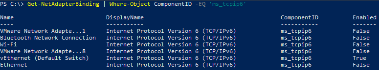
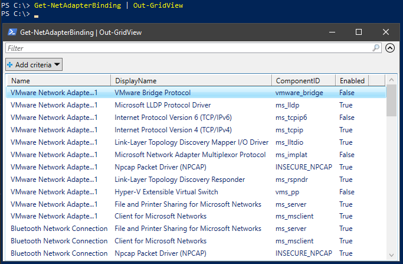
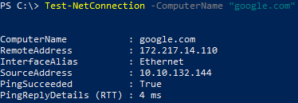
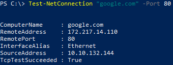
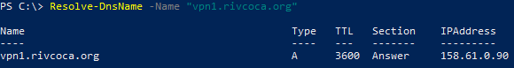

# NETWORKING

This section contains a variety of common network related powershell one-liners.

## Disable IPv6 for all Network Adapters
```powershell
Disable-NetAdapterBinding -Name '*' -ComponentID 'ms_tcpip6'
```

## View all network adapters IPv6 status
```powershell
Get-NetAdapterBinding | Where-Object ComponentID -EQ 'ms_tcpip6'
```


## View all network adapters status (Grid View)
```powershell
Get-NetAdapterBinding | Out-GridView
```


## Ping devices (local or remote)
```powershell title="Hostname or IP can be used."
Test-NetConnection -ComputerName “google.com”
Test-NetConnection -ComputerName “10.10.132.1”
```


## Check connectivity based on port or service
```powershell 
Test-NetConnection “google.com” -Port 80
```


## Perform DNS lookup
```powershell 
Resolve-DnsName -Name “vpn1.rivcoca.org”
```


## Flush DNS cache
```powershell 
Clear-DnsClientCache
```